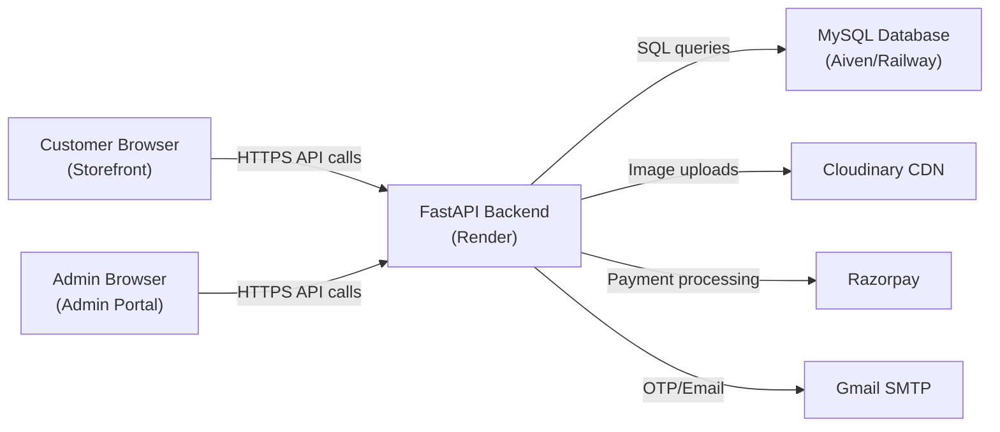

# 🚀 FreakFits — Production Deployment & Client Handover Guide

This is your complete, step-by-step guide to take FreakFits from your local machine to a live, production-ready website with a custom domain, ready to hand over to your client.

---

## Table of Contents

1. [Architecture Overview](#1-architecture-overview)
2. [Code Changes: Dev → Production](#2-code-changes-dev--production)
3. [Third-Party Service Setup](#3-third-party-service-setup)
4. [Deploy the MySQL Database (Cloud)](#4-deploy-the-mysql-database-cloud)
5. [Deploy the Backend API (Render)](#5-deploy-the-backend-api-render)
6. [Deploy the Frontend (Netlify)](#6-deploy-the-frontend-netlify)
7. [Custom Domain & SSL Setup](#7-custom-domain--ssl-setup)
8. [Pre-Launch Testing Checklist](#8-pre-launch-testing-checklist)
9. [Client Handover Package](#9-client-handover-package)

---

## 1. Architecture Overview

Your FreakFits project has **3 deployable components**:

| Component | Tech | What It Does | Where to Host |
|---|---|---|---|
| **Backend API** | FastAPI + Python | REST API, auth, payments, orders, admin | **Render** (free tier) |
| **Customer Storefront** | Static HTML/CSS/JS | Shopping pages customers see | **Netlify** (free tier) |
| **Admin Portal** | Static HTML/CSS/JS | Dashboard for managing orders/products | **Netlify** (free tier, separate site or subfolder) |
| **MySQL Database** | MySQL 8.0 | All persistent data | **Aiven / Railway / PlanetScale** |



---

## 2. Code Changes: Dev → Production

> [!CAUTION]
> These changes are **mandatory** before going live. Skipping any will cause security vulnerabilities or broken functionality.

### 2.1 Generate a Strong JWT Secret Key

Your current JWT secret is a placeholder. Generate a real one:

```bash
python -c "import secrets; print(secrets.token_hex(32))"
```

Copy the output (e.g. `a3f8b2c1d4e5f6...`) and set it in your production `.env`:

```env
JWT_SECRET_KEY=<paste-your-64-char-hex-here>
```

### 2.2 Switch Razorpay from Test → Live Mode

| Setting | Current (Test) | Production |
|---|---|---|
| `RAZORPAY_KEY_ID` | `rzp_test_TSRTZRiX0CVcdO` | `rzp_live_XXXXXXXX` |
| `RAZORPAY_KEY_SECRET` | `xHnuRtzOHJ1BdWZwFCKXUjaf` | *(from Razorpay dashboard)* |

**Steps to get live keys:**
1. Log in to [Razorpay Dashboard](https://dashboard.razorpay.com/)
2. Complete **KYC verification** (PAN card, bank account, business details)
3. Go to **Settings → API Keys → Generate Live Key**
4. Copy the `key_id` and `key_secret`

> [!IMPORTANT]
> The frontend `cart.html` reads the Razorpay key from the backend API response (`key_id` field), so you only need to update the `.env` file — no frontend code changes needed for Razorpay.

### 2.3 Lock Down CORS Origins

Change from wildcard `*` to your actual domains:

```env
CORS_ORIGINS=["https://freakfits.in","https://www.freakfits.in","https://admin.freakfits.in"]
```

### 2.4 Update All Frontend API Base URLs

You have **7 hardcoded references** to `http://127.0.0.1:8000`. These must all point to your production backend URL.

**After deploying the backend (Step 5), you'll get a URL like `https://freakfits-api.onrender.com`.**

Files to update:

| File | Line | Change To |
|---|---|---|
| `storefront/api-client.js` | Line 6 | `window.FREAKFITS_API_URL \|\| "https://freakfits-api.onrender.com/api"` |
| `storefront/products.js` | Line 6 | `window.FREAKFITS_API_URL \|\| "https://freakfits-api.onrender.com/api"` |
| `storefront/product.html` | Lines 635, 727 | `window.FREAKFITS_API_URL \|\| "https://freakfits-api.onrender.com/api"` |
| `storefront/orders-controller.js` | Line 332 | `window.FREAKFITS_API_URL \|\| "https://freakfits-api.onrender.com/api"` |
| `admin-portal/admin.js` | Line 18 | `"https://freakfits-api.onrender.com/api"` |
| `admin-portal/admin.js` | Line 828 | Replace `http://127.0.0.1:8000` with production URL |

### 2.5 Change the Super Admin Default Password

> [!WARNING]
> The default password `admin123` is in your seed script. Your client **must** change it immediately after first login using the Change Password modal you built.

Alternatively, update `seed.py` line 345 to use a stronger default before deploying:
```python
hashed_password=get_password_hash("StrongP@ssw0rd!2026"),
```

### 2.6 Disable Swagger Docs in Production (Optional but Recommended)

In `backend/app/main.py`, change:
```python
app = FastAPI(
    title="FreakFits API",
    docs_url=None,      # was "/api/docs"
    redoc_url=None,      # was "/api/redoc"
    openapi_url=None     # was "/api/openapi.json"
)
```

### 2.7 Add `slowapi` to requirements.txt

Your `requirements.txt` is missing the `slowapi` dependency used in `limiter.py`:

```
slowapi>=0.1.9
```

---

## 3. Third-Party Service Setup

### 3.1 Razorpay (Payment Gateway)

| Step | Action |
|---|---|
| 1 | Go to [dashboard.razorpay.com](https://dashboard.razorpay.com/) |
| 2 | Complete **KYC**: PAN card, Aadhaar, bank account, business address |
| 3 | Business Type: Select **"Individual / Sole Proprietor"** (since no GST) |
| 4 | Wait for approval (usually 2-3 business days) |
| 5 | Once approved, go to **Settings → API Keys → Generate Live Key** |
| 6 | Copy `key_id` (starts with `rzp_live_`) and `key_secret` |
| 7 | Set the **webhook URL** to `https://your-backend-url.com/api/payments/webhook` (if you add webhook support later) |

### 3.2 Cloudinary (Image CDN)

Your current Cloudinary account is already working. For production:

1. Go to [cloudinary.com/console](https://cloudinary.com/console)
2. Under **Settings → Upload**, set upload presets to **"Authenticated"** (not unsigned)
3. Under **Settings → Security**, enable **"Strict Transformations"** to prevent abuse
4. Your current cloud name `sjgw6cud` and keys stay the same — just keep them in the `.env`

### 3.3 Gmail SMTP (Email/OTP)

Your current setup (`supportfreakfits@gmail.com` with App Password) works for production. Keep in mind:

- Gmail allows **~500 emails/day** on free accounts
- For higher volume, consider [Brevo](https://www.brevo.com/) (free 300 emails/day) or [Resend](https://resend.com/) (free 100 emails/day)
- Your App Password (`abwmxmolntuazbnq`) should **never** be committed to Git

---

## 4. Deploy the MySQL Database (Cloud)

Your local MySQL needs to be replaced with a cloud-hosted MySQL instance.

### Option A: Aiven (Recommended — Free Tier)

1. Go to [aiven.io](https://aiven.io/) and sign up
2. Create a new **MySQL** service (free Hobbyist plan)
3. Wait for it to be provisioned (~2 mins)
4. Copy the connection details from the dashboard:
   ```env
   DB_HOST=mysql-xxxxxxxx.aiven.io
   DB_PORT=12345
   DB_USER=avnadmin
   DB_PASSWORD=<provided-password>
   DB_NAME=defaultdb
   ```
5. Aiven provides **SSL certificates** — download the CA cert if needed

### Option B: Railway

1. Go to [railway.app](https://railway.app/) and sign up
2. Create a new project → Add **MySQL** plugin
3. Copy the connection variables from the Railway dashboard
4. Railway gives you `MYSQL_URL` — extract host, port, user, password from it

### Option C: PlanetScale (Serverless MySQL)

1. Go to [planetscale.com](https://planetscale.com/) and sign up
2. Create a database → Get connection string
3. PlanetScale uses a special connection format; you may need to add `ssl_ca` parameter

> [!TIP]
> **Aiven** is the simplest for your use case — it gives you a standard MySQL instance that works identically to your local one, with zero code changes needed.

### Migrate Your Local Data

After setting up the cloud database, your app will auto-create tables and seed data on first startup (via `seed_database()`). If you want to migrate existing orders/customers:

```bash
# Export from local MySQL
mysqldump -u root -p freakfits_db > freakfits_backup.sql

# Import to cloud MySQL (example with Aiven)
mysql -h mysql-xxx.aiven.io -P 12345 -u avnadmin -p defaultdb < freakfits_backup.sql
```

---

## 5. Deploy the Backend API (Render)

### Step 1: Prepare Your Repo

Create a `Procfile` (or use Render's start command) and ensure your project is on **GitHub**.

**Push to GitHub:**
```bash
cd "c:\Users\arnab.ARNAB\OneDrive\Documents\Personal Projects\FreakFits"
git init
git add .
git commit -m "FreakFits v1.0 — Production ready"
git remote add origin https://github.com/YOUR_USERNAME/freakfits.git
git push -u origin main
```

> [!CAUTION]
> Create a `.gitignore` file **before** pushing to avoid leaking secrets:
> ```
> backend/.env
> backend/venv/
> backend/__pycache__/
> backend/freakfits.db
> .venv/
> *.pyc
> node_modules/
> ```

### Step 2: Deploy on Render

1. Go to [render.com](https://render.com/) and sign up (free)
2. Click **"New" → "Web Service"**
3. Connect your GitHub repo
4. Configure:

| Setting | Value |
|---|---|
| **Name** | `freakfits-api` |
| **Region** | Singapore (closest to India) |
| **Root Directory** | `backend` |
| **Runtime** | Python 3 |
| **Build Command** | `pip install -r requirements.txt` |
| **Start Command** | `uvicorn app.main:app --host 0.0.0.0 --port $PORT` |
| **Instance Type** | Free |

5. Add **Environment Variables** (click "Advanced → Add Environment Variable"):

| Key | Value |
|---|---|
| `DB_HOST` | *(from your cloud MySQL)* |
| `DB_PORT` | *(from your cloud MySQL)* |
| `DB_USER` | *(from your cloud MySQL)* |
| `DB_PASSWORD` | *(from your cloud MySQL)* |
| `DB_NAME` | *(from your cloud MySQL)* |
| `JWT_SECRET_KEY` | *(your generated 64-char hex)* |
| `JWT_ALGORITHM` | `HS256` |
| `ACCESS_TOKEN_EXPIRE_MINUTES` | `1440` |
| `SMTP_HOST` | `smtp.gmail.com` |
| `SMTP_PORT` | `587` |
| `SMTP_USER` | `supportfreakfits@gmail.com` |
| `SMTP_PASSWORD` | *(your Gmail App Password)* |
| `SMTP_FROM_EMAIL` | `supportfreakfits@gmail.com` |
| `SMTP_FROM_NAME` | `FreakFits Official` |
| `RAZORPAY_KEY_ID` | *(live key)* |
| `RAZORPAY_KEY_SECRET` | *(live secret)* |
| `CLOUDINARY_CLOUD_NAME` | `sjgw6cud` |
| `CLOUDINARY_API_KEY` | *(your key)* |
| `CLOUDINARY_API_SECRET` | *(your secret)* |
| `CLOUDINARY_FOLDER` | `freakfits` |
| `CORS_ORIGINS` | `["https://freakfits.in","https://www.freakfits.in"]` |

6. Click **"Create Web Service"** — Render will build and deploy automatically
7. Your API will be live at: `https://freakfits-api.onrender.com`
8. Test it: visit `https://freakfits-api.onrender.com/api/health`

> [!NOTE]
> **Render free tier** spins down after 15 minutes of inactivity. The first request after sleep takes ~30 seconds. For always-on, upgrade to the $7/month Starter plan. Alternatively, use [UptimeRobot](https://uptimerobot.com/) to ping your `/api/health` endpoint every 14 minutes to keep it awake (free).

---

## 6. Deploy the Frontend (Netlify)

### Step 1: Deploy Customer Storefront

1. Go to [netlify.com](https://app.netlify.com/) and sign up (free)
2. Click **"Add new site" → "Import an existing project"**
3. Connect your GitHub repo
4. Configure:

| Setting | Value |
|---|---|
| **Base directory** | `storefront` |
| **Build command** | *(leave blank — it's static HTML)* |
| **Publish directory** | `storefront` |

5. Click **Deploy site**
6. Your storefront will be live at: `https://random-name.netlify.app`

### Step 2: Deploy Admin Portal

**Option A: Separate Netlify Site**
1. Create another Netlify site
2. Set **Base directory** to `admin-portal` and **Publish directory** to `admin-portal`
3. Your admin portal will be at: `https://another-name.netlify.app`

**Option B: Subdomain (Recommended)**
- Deploy the admin portal as a separate site and later map it to `admin.freakfits.in`

### Step 3: Add `_redirects` file for SPA-style routing (Optional)

If any pages have issues with direct URL access, create `storefront/_redirects`:
```
/* /index.html 200
```

---

## 7. Custom Domain & SSL Setup

### Step 1: Buy a Domain

| Registrar | Price (approx) | Notes |
|---|---|---|
| [Namecheap](https://namecheap.com) | ₹700-900/yr for `.in` | Best value |
| [GoDaddy](https://godaddy.com) | ₹500-800/yr for `.in` | Popular in India |
| [Google Domains](https://domains.google) | ₹700/yr for `.in` | Clean interface |
| [Hostinger](https://hostinger.in) | ₹399-599/yr for `.in` | Budget option |

**Recommended domain:** `freakfits.in` or `freakfits.com`

### Step 2: Configure DNS Records

After purchasing, go to your registrar's DNS settings and add these records:

#### For Customer Storefront (Netlify):

| Type | Name | Value | TTL |
|---|---|---|---|
| `CNAME` | `www` | `random-name.netlify.app` | Auto |
| `A` | `@` | `75.2.60.5` | Auto |

*(Netlify provides the exact A record IPs in their custom domain setup)*

#### For Admin Portal (Netlify — separate site):

| Type | Name | Value | TTL |
|---|---|---|---|
| `CNAME` | `admin` | `another-name.netlify.app` | Auto |

#### For Backend API (Render):

| Type | Name | Value | TTL |
|---|---|---|---|
| `CNAME` | `api` | `freakfits-api.onrender.com` | Auto |

### Step 3: Add Domains in Netlify & Render

**Netlify:**
1. Go to **Site settings → Domain management → Add custom domain**
2. Enter `freakfits.in` and `www.freakfits.in`
3. Netlify will auto-provision a **free SSL certificate** (Let's Encrypt)

**Render:**
1. Go to your web service → **Settings → Custom Domains**
2. Add `api.freakfits.in`
3. Render will auto-provision SSL

### Step 4: Update API URLs to Use Custom Domain

Once DNS propagates (usually 10-30 minutes), update your frontend code to use:
```
https://api.freakfits.in/api
```
instead of `https://freakfits-api.onrender.com/api`.

### Final Domain Map:

| URL | Points To |
|---|---|
| `https://freakfits.in` | Customer storefront (Netlify) |
| `https://www.freakfits.in` | Customer storefront (Netlify) |
| `https://admin.freakfits.in` | Admin portal (Netlify) |
| `https://api.freakfits.in` | Backend API (Render) |

---

## 8. Pre-Launch Testing Checklist

Run through this checklist on the **production deployment** before handing over:

### ✅ Authentication & Security
- [ ] Register a new customer account → receive OTP email → verify → login
- [ ] Forgot password flow → receive OTP → reset password → re-login
- [ ] Admin login with `supportfreakfits@gmail.com`
- [ ] Change admin password via modal
- [ ] Employee access request flow (request → OTP → pending → approve → login)
- [ ] JWT tokens expire correctly after 24 hours

### ✅ Shopping Flow
- [ ] Browse products on homepage and category pages
- [ ] View individual product page with size/price selection
- [ ] Add items to cart → cart persists across page refreshes
- [ ] Apply coupon code `FREAK5P` → discount reflects correctly
- [ ] Enter invalid coupon → clean error message shown

### ✅ Payment & Orders
- [ ] Complete a **Cash on Delivery** order → order confirmation shown
- [ ] Complete a **Razorpay** payment (use ₹1 test if still in test mode) → payment verified
- [ ] View order in My Orders page
- [ ] Track order via order code
- [ ] Download invoice PDF → correct address, no GST

### ✅ Admin Operations
- [ ] View dashboard stats (orders, revenue, products)
- [ ] Update order status (Pending → Shipped → Delivered)
- [ ] Add a new jersey product with image upload → appears on storefront
- [ ] Process a return request
- [ ] View and delete support messages
- [ ] Manager role cannot delete products or change prices
- [ ] Viewer role has read-only access

### ✅ Infrastructure
- [ ] Backend `/api/health` returns `200 OK`
- [ ] All pages load over HTTPS (no mixed content warnings)
- [ ] CORS is locked to production domains only
- [ ] Swagger docs are disabled (if you chose to disable them)
- [ ] Image uploads to Cloudinary work from admin portal
- [ ] Emails (OTP, order confirmation, access approval) are delivered

---

## 9. Client Handover Package

Prepare these documents/assets for your client:

### 9.1 Credentials Document (Private, Encrypted)

Create a secure document (password-protected PDF or use a password manager) with:

```
=== FreakFits Credentials ===

ADMIN PORTAL
URL: https://admin.freakfits.in
Email: supportfreakfits@gmail.com
Password: [changed password]

HOSTING ACCOUNTS
Render: [email] / [password]
Netlify: [email] / [password]
Aiven MySQL: [email] / [password]

PAYMENT GATEWAY
Razorpay Dashboard: https://dashboard.razorpay.com
Email: [razorpay account email]

IMAGE CDN
Cloudinary Console: https://cloudinary.com/console
Email: [cloudinary account email]

DOMAIN REGISTRAR
Provider: [Namecheap/GoDaddy]
Domain: freakfits.in
Login: [email] / [password]

EMAIL
Gmail: supportfreakfits@gmail.com
App Password: [16-char app password]
```

### 9.2 Admin User Manual (1-Page Quick Guide)

| Task | How To |
|---|---|
| **Add a new jersey** | Admin Portal → Products tab → Fill form → Upload image → Submit |
| **Update order status** | Admin Portal → Orders tab → Click order → Change status dropdown |
| **Process a return** | Admin Portal → Returns tab → Review request → Approve/Reject |
| **Add a coupon code** | Requires database access (provide a simple script or admin endpoint) |
| **Change your password** | Admin Portal → Click 🔒 Change Password in sidebar |
| **View support messages** | Admin Portal → Messages tab → Reply via email → Delete when resolved |
| **Add an employee** | Employee requests access → You see it in Access Requests tab → Approve with role |

### 9.3 Maintenance Notes

| Task | Frequency | How |
|---|---|---|
| **Database backup** | Weekly | Export from Aiven/Railway dashboard |
| **Check server health** | Daily (automated) | Set up [UptimeRobot](https://uptimerobot.com/) to ping `/api/health` |
| **Renew domain** | Yearly | Auto-renew is usually enabled by default |
| **SSL certificates** | Auto-renewed | Netlify and Render handle this automatically |
| **Monitor Razorpay** | Weekly | Check dashboard for failed payments or disputes |

---

## Quick Reference: Complete Deployment Order

```
Step 1  →  Create GitHub repo with .gitignore
Step 2  →  Set up cloud MySQL (Aiven)
Step 3  →  Deploy backend on Render (add env vars)
Step 4  →  Test backend: /api/health
Step 5  →  Update frontend API URLs to Render URL
Step 6  →  Deploy storefront on Netlify
Step 7  →  Deploy admin portal on Netlify
Step 8  →  Buy domain (freakfits.in)
Step 9  →  Configure DNS records
Step 10 →  Add custom domains in Netlify & Render
Step 11 →  Wait for DNS propagation (~30 min)
Step 12 →  Update API URLs to custom domain (api.freakfits.in)
Step 13 →  Redeploy frontend on Netlify
Step 14 →  Switch Razorpay to live keys
Step 15 →  Run pre-launch checklist
Step 16 →  Hand over credentials to client
```

> [!TIP]
> **Total cost for hosting (minimum):**
> | Service | Cost |
> |---|---|
> | Render (Backend) | Free (or $7/mo for always-on) |
> | Netlify (Frontend) | Free |
> | Aiven MySQL | Free (Hobbyist) |
> | Cloudinary | Free (25GB) |
> | Gmail SMTP | Free |
> | Domain (.in) | ~₹500-900/year |
> | **Total** | **₹500-900/year** (or +$7/mo for premium backend) |
